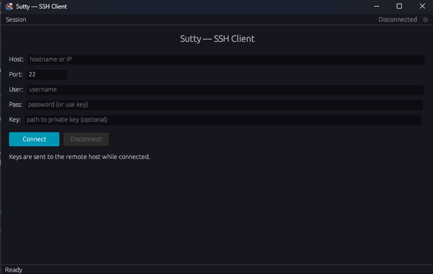
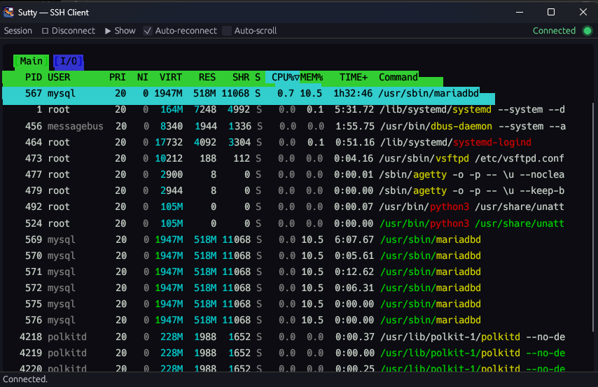

# Sutty — SSH Client

A PuTTY-like SSH client written in pure Rust, with both a **terminal-based (TUI)** and a **native GUI** interface.

## Features

- **GUI client** (`sutty-gui`) — native Windows window with dark theme, colored terminal emulation, session management
- **TUI client** (`sutty`) — terminal-based SSH client with a connection dialog
- **AES-256-GCM encrypted password storage** — saved sessions have passwords encrypted at rest
- **Session management** — save, load, delete connection profiles
- **Auto-reconnect** — automatically reconnects on unexpected disconnection (configurable, up to 5 attempts with 5s delay)
- **ANSI color support** — htop, vim, tmux, and other color-using TUI apps render correctly
- **Blinking cursor** — visible cursor overlay in the terminal view
- **Keyboard passthrough** — all keys including Ctrl+letter combos forwarded to the remote shell
- **Auto-scroll** — scrolls to cursor on new output; manual scrolling preserved
- **Sidebar toggle** — hide/show connection panel while connected
- **Save prompt** — prompts to save connection details after first successful connect
- **Modified data detection** — alerts when saved session data has been changed

## Screenshots

### Login



### Terminal with htop



## Building

### Prerequisites
- [Rust](https://rustup.rs) 1.70+

### Quick build
```sh
# Windows — double-click or run:
build.bat

# Or manually:
cargo build --release -p sutty      # TUI client
cargo build --release -p sutty-gui  # GUI client
```

Binaries are in `target/release/`.

## Usage

### GUI client
```sh
sutty-gui.exe
```
- Fill in host/port/username and click **Connect** (or press Enter)
- Select saved sessions from the **Saved** dropdown
- Use **▶ Show** button to toggle the connection sidebar
- Toggle **Auto-reconnect** to enable/disable automatic reconnection on drop
- Press **⏻ Disconnect** to close the session

### TUI client
```sh
sutty.exe                          # Launch connection dialog
sutty.exe user@host                # Quick connect
sutty.exe user@host:2222           # Custom port
sutty.exe -H host -u user -i ~/.ssh/id_rsa   # Key-based auth
sutty.exe --session myserver       # Connect via saved session
```

### Keyboard shortcuts (GUI)
| Key | Action |
|---|---|
| `Ctrl+A`–`Ctrl+Z` | Send control characters to remote shell |
| `Ctrl+[` | Escape |
| `Ctrl+\` | Quit signal |
| Arrow keys, Home, End, PgUp, PgDn | Navigation |
| F1–F12 | Function keys |

## Project structure

```
sutty/
├── sutty-core/          # Shared library: SSH client + encrypted session config
│   └── src/
│       ├── ssh.rs       # russh-based SSHv2 connection
│       └── config.rs    # AES-256-GCM encrypted session storage
├── sutty/               # TUI client (terminal-based)
│   └── src/
│       ├── main.rs      # CLI parsing + TUI launcher
│       ├── terminal.rs  # Raw terminal mode + key translation
│       └── tui/         # Ratatui connection dialog
└── sutty-gui/           # GUI client (native window)
    └── src/
        ├── main.rs      # eframe window setup
        ├── app.rs       # Application state + SSH background task
        └── ui.rs        # egui rendering: form, terminal, status bar
```

## Configuration

Sessions are stored in:
- **Windows**: `%LOCALAPPDATA%\sutty\sessions.json`
- **Linux/macOS**: `~/.config/sutty/sessions.json`

Passwords are encrypted with AES-256-GCM before storage.

## License

MIT
